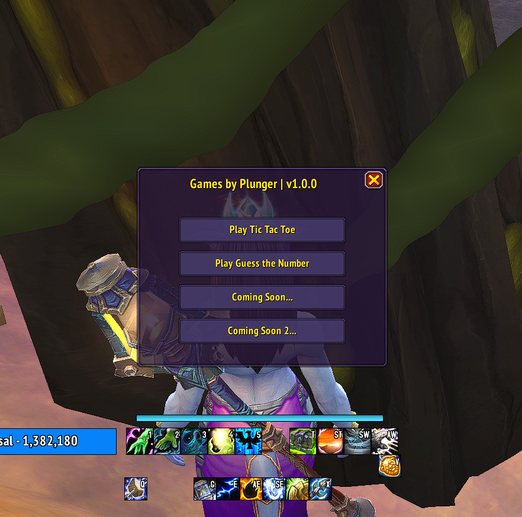
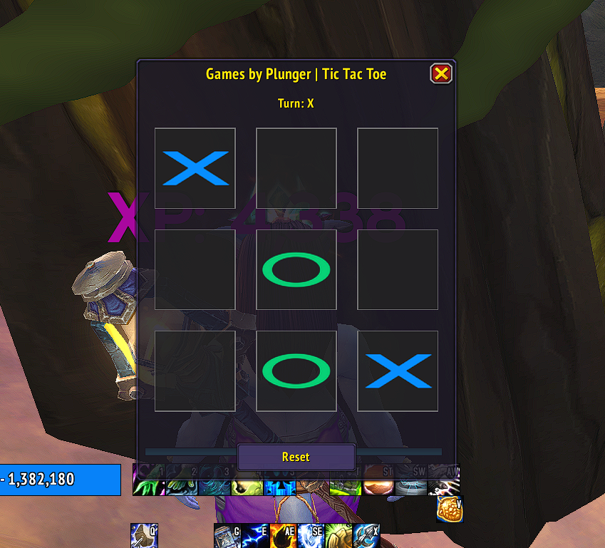
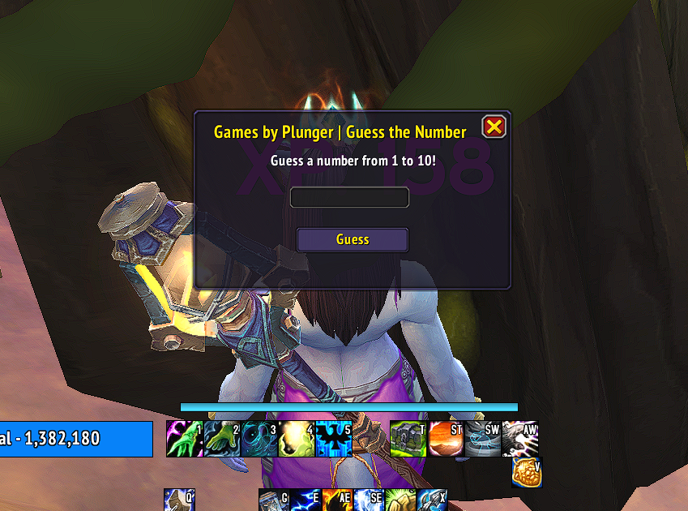

# Games Addon


[](https://github.com/nickstuer/games-addon/commits/master) [](https://github.com/nickstuer/games-addon)

A World of Warcraft addon for mini games to help pass the time in World of Warcraft. Currently has Tic Tac Toe vs. AI and Guess the Number.


## 📌 Screenshots






## 🎮 Games

### Tik Tac Toe
Play a classic game of tic tac toe against AI. (Note: Playing against friends/guildies/party members is coming soon!)

### Guess the Number
Play a game of guess the number where you have to guess a random number between 1-10.

## 🛠 Install
```
1. Download from [CurseForge](https://www.curseforge.com/wow/addons/games) or use the CurseForge/WoWUp-CF app
2. Extract to your 'World of Warcraft/Interface/AddOns' folder
3. Ensure the addon is enabled on the character selection screen
```

## 💻 How to Play
Just type /games to open the game launcher!
```
/games
```

## 🔗 Coming Soon
These new features will be coming in a future release.
- Game record keeping
- Play against friends
- Play against party/raid members
- Play against guild members
- Guild leaderboards

## 🏆 Contributing

#### Bug Reports and Feature Requests
Please use the [issue tracker](https://github.com/nickstuer/games-addon/issues) to report any bugs or request new features.

#### Contributors

<a href = "https://github.com/nickstuer/games-addon/graphs/contributors">
  
</a>
